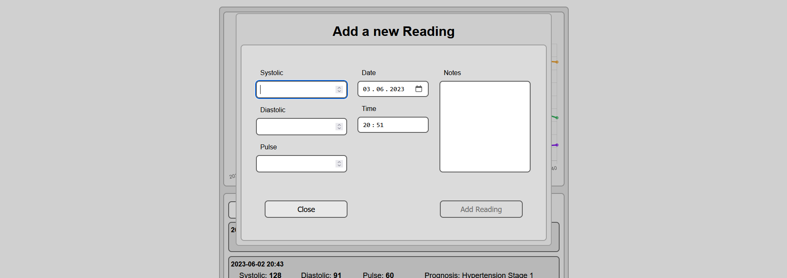

# Blood Pressure Monitoring App

This project was generated with [Angular CLI](https://github.com/angular/angular-cli) version 16.0.3.

## Functionality

### Adding a new Reading

To enter new values, a dialog box with a form is opened.
Only when all fields (except for notes) are filled, the data can be saved.
Date and time are entered automatically when the form is called.

### Viewing the Readings

On the main page, the record shows all the readings entered, with the newest one on top.
In addition to the entered values, a forecast is offered.
This is not to be considered as a medical diagnosis and serves only as a guide!

### Monitor

At the top you can see a chart with the entered values.

## Preview

### Overview of the App

### Dialog Window when adding a new Reading

